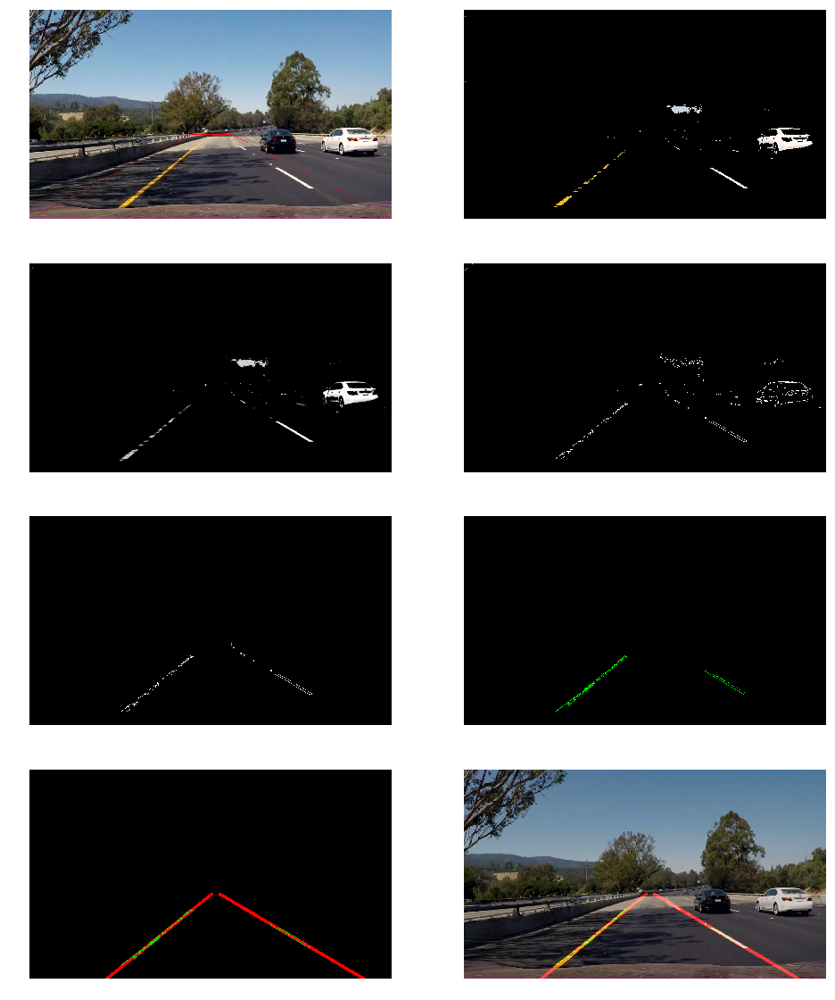

#**Finding Lane Lines on the Road** 

### Reflection

###1. Describe your pipeline. As part of the description, explain how you modified the draw_lines() function.

I used the standard cv2 operations in the pipeline: greyscale, blurring, canny edges, region of interest and hough lines.

In `draw_lines()` I filtered the hough lines to have a slope of at least +/-0.5 and separated the points to left and right side and used `np.polyfit` to fit a line on all the start and end points on the side.

This was sufficient for the white and yellow examples, but the challenge video required more as some frames have a lot of noise on the road (shadows) and some frames have very faint lane markings. These frames seemed to be insufficient alone to produce a good fit, so I looked at maintaining the state between frames.

To get around this I maintain an exponential moving average of the slope of intercept. By choosing an appropriate decay rate for the smoothing I was able to produce a relatively smooth lane marking over the difficult frames as well.

###2. Identify potential shortcomings with your current pipeline

A continously very noisy road surface (uneven, shadowy, darker lights etc) would make it very difficult to have a stable fit. Many nearby cars would probably also make the region of interest unusable.

In the challenge video the road is turning, there the straight line fitting is only valid for a short range.

###3. Suggest possible improvements to your pipeline

Trying to enhance the contrasts and augmenting the colors of interest at the begninng of the pipeline could help the canny/hough operations.

I used all the points on the side to fit the lane line, but I could also try to filter out some hough lines to begin with, eg. points on the lane should form the longest line as opposed to random shadow lines.

Turns can't be fit with a straight line, a higher degree polyfit would be needed.

